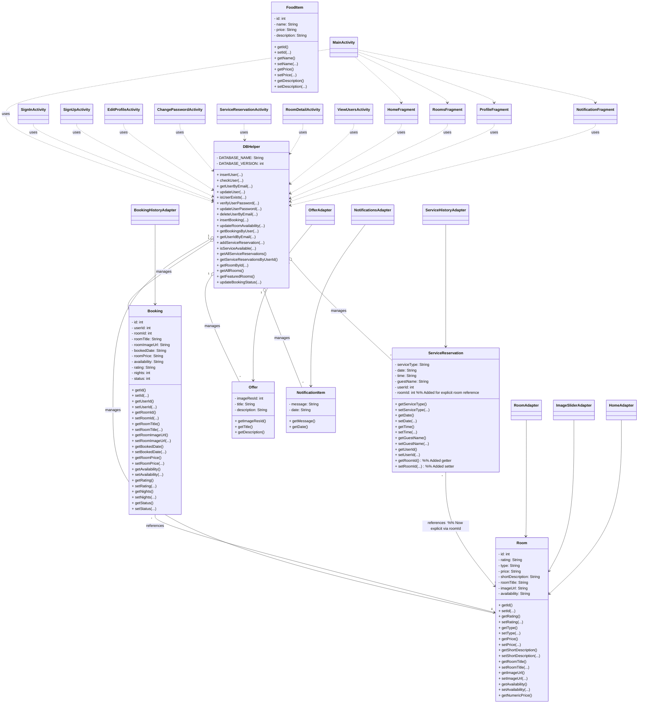

# Class Diagram Guide for LuxeVistaResort App

## **Classes and Their Roles**

### **1. DBHelper**

- **Location:** DBHelper.java
- **Role:** Handles all database operations (CRUD) for users, rooms, bookings, service reservations, etc.
- **Key Methods:**  
  - `insertUser`, `checkUser`, `getUserByEmail`, `updateUser`, `insertBooking`, `getBookingsByUser`, `getAllRooms`, `addServiceReservation`, `getServiceReservationsByUserId`, etc.
- **Relationships:**  
  - **Aggregation (`o--`)** with `Booking`, `Room`, `ServiceReservation`, `Offer`, `NotificationItem`:  
    DBHelper manages collections of these objects by reading/writing them to the database.
  - **Dependency (`..>`)** with all Activities/Fragments:  
    All major screens use DBHelper to access or update data.

---

### **2. Booking**

- **Location:** Booking.java
- **Role:** Represents a room booking made by a user.
- **Fields:** `id`, `userId`, `roomId`, `roomTitle`, `roomImageUrl`, `bookedDate`, `roomPrice`, `availability`, `rating`, `nights`, `status`
- **Relationships:**  
  - **Association (`-->`)** with `Room`:  
    Each booking references a specific room via `roomId`.
  - **Managed by DBHelper:**  
    Bookings are created, updated, and fetched through DBHelper.

---

### **3. Room**

- **Location:** Room.java
- **Role:** Represents a hotel room.
- **Fields:** `id`, `rating`, `type`, `price`, `shortDescription`, `roomTitle`, `imageUrl`, `availability`
- **Relationships:**  
  - **Managed by DBHelper:**  
    Rooms are loaded, updated, and queried via DBHelper.
  - **Referenced by Booking and ServiceReservation:**  
    Bookings and (implicitly) service reservations are linked to rooms.

---

### **4. ServiceReservation**

- **Location:** ServiceReservation.java
- **Role:** Represents a reservation for a hotel service (spa, etc.).
- **Fields:** `serviceType`, `date`, `time`, `guestName`, `userId`
- **Relationships:**  
  - **Managed by DBHelper:**  
    Created and fetched via DBHelper.
  - **Association with Room:**  
    Not explicit in the model, but service reservations can be linked to rooms by `room_id` in the database.

---

### **5. Offer**

- **Location:** Offer.java
- **Role:** Represents a promotional offer.
- **Fields:** `imageResId`, `title`, `description`
- **Relationships:**  
  - **Managed by DBHelper:**  
    Offers can be loaded from the database.

---

### **6. NotificationItem**

- **Location:** NotificationItem.java
- **Role:** Represents a notification message.
- **Fields:** `message`, `date`
- **Relationships:**  
  - **Managed by DBHelper:**  
    Notifications can be stored and retrieved.

---

### **7. FoodItem**

- **Location:** FoodItem.java
- **Role:** Placeholder for food menu items (currently empty).

---

### **8. Adapters**

- **RoomAdapter:** Displays a list of rooms (`RoomAdapter.java`)
- **BookingHistoryAdapter:** Displays a list of bookings (`BookingHistoryAdapter.java`)
- **ServiceHistoryAdapter:** Displays a list of service reservations (`ServiceHistoryAdapter.java`)
- **OfferAdapter:** Displays a list of offers (`OfferAdapter.java`)
- **NotificationsAdapter:** Displays a list of notifications (`NotificationsAdapter.java`)
- **ImageSliderAdapter:** Displays images in a slider (`ImageSliderAdapter.java`)
- **HomeAdapter:** Displays featured rooms on the home screen (`HomeAdapter.java`)
- **Relationships:**  
  - Each adapter uses its respective model class to display data in RecyclerViews.

---

### **9. Activities/Fragments**

- **MainActivity:** Hosts the main navigation and fragments.
- **SignInActivity, SignUpActivity, EditProfileActivity, ChangePasswordActivity, ServiceReservationActivity, RoomDetailActivity, ViewUsersActivity:** Each handles a specific screen or user flow.
- **HomeFragment, RoomsFragment, ProfileFragment, NotificationFragment:** Each represents a tab or section in the app.
- **Relationships:**  
  - **Dependency (`..>`)** on DBHelper:  
    All these screens use DBHelper to fetch or update data.
  - **MainActivity ..> Fragments:**  
    MainActivity switches between fragments for navigation.

---

## **Relationships Explained**

### **A. Aggregation (`o--`)**

- **DBHelper "1" o-- "*" Booking/Room/ServiceReservation/Offer/NotificationItem**
  - DBHelper manages collections of these objects. For example, `getAllRooms()` returns a list of `Room` objects, `getBookingsByUser()` returns a list of `Booking` objects, etc.

### **B. Association (`-->`)**

- **Booking "*" --> "1" Room**
  - Each booking is associated with one room (via `roomId`), but a room can have many bookings.
- **ServiceReservation "*" --> "1" Room**
  - Each service reservation can be associated with a room (not explicit in the model, but possible via database).

### **C. Dependency (`..>`)**

- **Activities/Fragments ..> DBHelper**
  - All screens use DBHelper for data operations. For example:
    - `SignInActivity` uses `dbHelper.checkUser()` to log in.
    - `RoomsFragment` uses `dbHelper.getAllRooms()` to show rooms.
    - `ProfileFragment` uses `dbHelper.getBookingsByUser()` to show booking history.
    - `ServiceReservationActivity` uses `dbHelper.addServiceReservation()` to book a service.
- **MainActivity ..> Fragments**
  - MainActivity loads and switches between `HomeFragment`, `RoomsFragment`, `ProfileFragment`, and `NotificationFragment` for navigation.

### **D. Adapter Relationships**

- **RoomAdapter --> Room**
  - Displays a list of rooms.
- **BookingHistoryAdapter --> Booking**
  - Displays a list of bookings.
- **ServiceHistoryAdapter --> ServiceReservation**
  - Displays a list of service reservations.
- **OfferAdapter --> Offer**
  - Displays a list of offers.
- **NotificationsAdapter --> NotificationItem**
  - Displays a list of notifications.
- **ImageSliderAdapter --> Room**
  - Displays room images in a slider.
- **HomeAdapter --> Room**
  - Displays featured rooms on the home screen.

---

## **Summary Table**

| Class/Adapter/Fragment          | Main Role/Model Used                | Example Code Reference                                  |
|---------------------------------|-------------------------------------|---------------------------------------------------------|
| DBHelper                        | Database operations                 | DBHelper.java                                         |
| Booking                         | Room booking model                  | Booking.java                                          |
| Room                            | Room model                          | Room.java                                             |
| ServiceReservation              | Service reservation model           | ServiceReservation.java                               |
| Offer                           | Offer model                         | Offer.java                                            |
| NotificationItem                | Notification model                  | NotificationItem.java                                 |
| RoomAdapter                     | Displays rooms                      | RoomAdapter.java uses `Room`                          |
| BookingHistoryAdapter           | Displays bookings                   | BookingHistoryAdapter.java uses `Booking`             |
| ServiceHistoryAdapter           | Displays service reservations       | ServiceHistoryAdapter.java uses `ServiceReservation`  |
| OfferAdapter                    | Displays offers                     | OfferAdapter.java uses `Offer`                        |
| NotificationsAdapter            | Displays notifications              | NotificationsAdapter.java uses `NotificationItem`     |
| ImageSliderAdapter              | Displays room images                | ImageSliderAdapter.java uses `Room`                   |
| HomeAdapter                     | Displays featured rooms             | HomeAdapter.java uses `Room`                          |
| MainActivity                    | Hosts navigation                    | MainActivity.java                                     |
| SignInActivity                  | Login screen                        | SignInActivity.java uses `DBHelper`                   |
| SignUpActivity                  | Registration screen                 | SignUpActivity.java uses `DBHelper`                   |
| EditProfileActivity             | Edit profile                        | EditProfileActivity.java uses `DBHelper`              |
| ChangePasswordActivity          | Change password                     | ChangePasswordActivity.java uses `DBHelper`           |
| ServiceReservationActivity      | Book a service                      | ServiceReservationActivity.java uses `DBHelper`       |
| RoomDetailActivity              | Room details and booking            | RoomDetailActivity.java uses `DBHelper`               |
| ViewUsersActivity               | Admin: view users/bookings          | ViewUsersActivity.java uses `DBHelper`                |
| HomeFragment                    | Home tab                            | HomeFragment.java uses `DBHelper`                     |
| RoomsFragment                   | Rooms tab                           | RoomsFragment.java uses `DBHelper`                    |
| ProfileFragment                 | Profile tab                         | ProfileFragment.java uses `DBHelper`                  |
| NotificationFragment            | Notifications tab                   | NotificationFragment.java uses `DBHelper`             |

---

## **How This Looks in Code**

- **Example:**  
  In RoomsFragment.java:

  ```java
  DBHelper dbHelper = new DBHelper(getContext());
  fullRoomList = dbHelper.getAllRooms();
  roomAdapter = new RoomAdapter(getContext(), fullRoomList);
  rvRooms.setAdapter(roomAdapter);
  ```

  - Here, `RoomsFragment` depends on `DBHelper` to get a list of `Room` objects, which are then displayed using `RoomAdapter`.

- **Example:**  
  In ProfileFragment.java:

  ```java
  List<Booking> bookingList = dbHelper.getBookingsByUser(userId);
  bookingHistoryAdapter = new BookingHistoryAdapter(bookingList);
  bookingHistoryRecyclerView.setAdapter(bookingHistoryAdapter);
  ```

  - Here, `ProfileFragment` uses `DBHelper` to get bookings for the user and displays them with `BookingHistoryAdapter`.

---

## **Legend Recap**

- **o--** Aggregation: "manages" (e.g., DBHelper manages Bookings)
- **-->** Association: "references" (e.g., Booking references Room)
- **..>** Dependency: "uses" (e.g., Activity uses DBHelper)

---

**In summary:**  
Each class in the diagram corresponds to a real Java class in your code. The relationships show how data flows between them:  

- DBHelper is the central hub for data.  
- Activities and fragments use DBHelper to get or update data.  
- Adapters display lists of models in the UI.  
- Models represent the core data (rooms, bookings, services, etc.).  
- Relationships in the diagram match how these classes interact in your codebase.

If you want a specific example for any class or relationship, let me know!

## UML Class Diagram for LuxeVistaResort App


